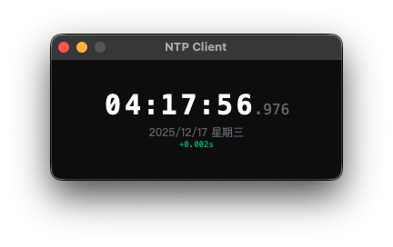
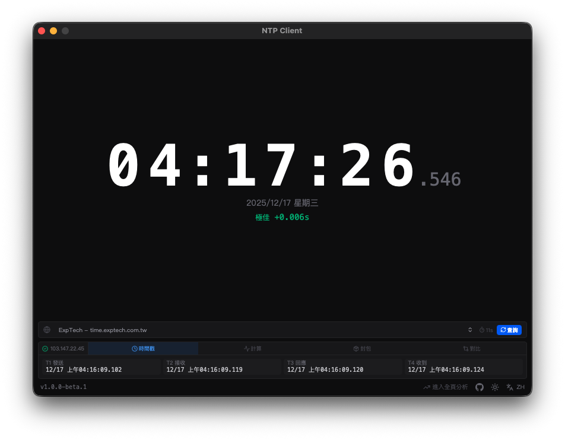
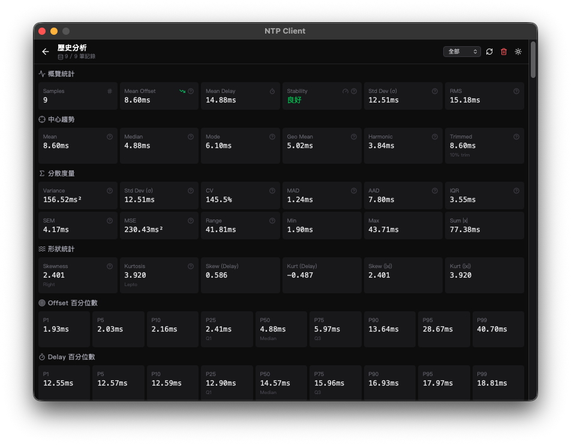

<div align="center">


# NTP Client

High-precision Network Time Synchronization Tool

[](LICENSE)
[](https://github.com/ExpTechTW/ntp-client/releases)
[](https://github.com/ExpTechTW/ntp-client/releases)
[](https://github.com/ExpTechTW/ntp-client/actions)

[繁體中文](README.md) | **English** | [日本語](README.ja.md)

</div>

## Screenshots

<div align="center">



</div>

## Features

- **Ultra Lightweight** - Only 8MB on macOS, 3MB on Windows, extremely small installation size
- **Precise Synchronization** - Uses a median algorithm with 5 measurements to ensure accurate time offset measurement
- **Auto Sync** - Automatically synchronizes time every 60 seconds
- **Multiple Servers** - Supports NTP servers including ExpTech, Apple, Google, Cloudflare, and more
- **Cross-platform** - Native support for macOS, Windows, and Linux
- **Dark/Light Theme** - Switch between dark and light modes
- **Multi-language** - Supports Traditional Chinese, English, and Japanese

## Download & Install

<div align="center">

[](https://github.com/ExpTechTW/ntp-client/releases/latest)
[](https://github.com/ExpTechTW/ntp-client/releases/latest)
[](https://github.com/ExpTechTW/ntp-client/releases/latest)

</div>

### Supported Systems

| Operating System | Version       | Architecture           | Notes                          |
| ---------------- | ------------- | ---------------------- | ------------------------------ |
| **macOS**        | 10.13+        | Intel / Apple Silicon  | Requires Sidecar Server        |
| **Windows**      | 10+           | x64                    | Requires WebView2              |
| **Linux**        | Ubuntu 22.04+ | x64                    | Requires GLib 2.70+, WebKitGTK 4.1 |

### macOS Installation

1. Download and install the `.dmg` file
2. Click the "Install Sidecar Server" button in the application to obtain time synchronization permissions

> Sidecar Server is a helper program that runs as a system service to set system time with administrator privileges.

### Windows Installation

1. Download and run the `.exe` installer
2. The application will request administrator privileges when running to set Windows system time

### Linux Installation

```bash
chmod +x ntp-client_*.AppImage
./ntp-client_*.AppImage
```

Time synchronization requires `pkexec` to elevate privileges.

## Usage

### Time Status

| Status      | Offset    | Description              |
| ----------- | --------- | ------------------------ |
| **Excellent** | < 10ms  | Highly accurate time     |
| **Good**    | < 50ms  | Accurate time            |
| **Normal**  | < 100ms | Acceptable time          |
| **Drift**   | < 500ms | Noticeable offset        |
| **Abnormal** | ≥ 500ms | Excessive offset        |

### Information Tab

- **Timestamps** - T1/T2/T3/T4 four time points
- **Calculations** - Offset, Delay, RTT, processing time
- **Packet** - Detailed NTP packet information (Stratum, Poll, Precision)
- **Comparison** - Offset comparison before and after synchronization

## License

[AGPL-3.0](LICENSE) - Free to use, modify, and distribute. Modifications must be open source.

## Contributing

1. Fork this project
2. Create a feature branch (`git checkout -b feature/amazing`)
3. Commit your changes (`git commit -m 'Add amazing feature'`)
4. Push to the branch (`git push origin feature/amazing`)
5. Open a Pull Request

## Support

- [Issues](https://github.com/ExpTechTW/ntp-client/issues) - Report issues
- [Discussions](https://github.com/ExpTechTW/ntp-client/discussions) - Feature suggestions

---

<div align="center">

**[ExpTech](https://github.com/ExpTechTW)**

</div>

